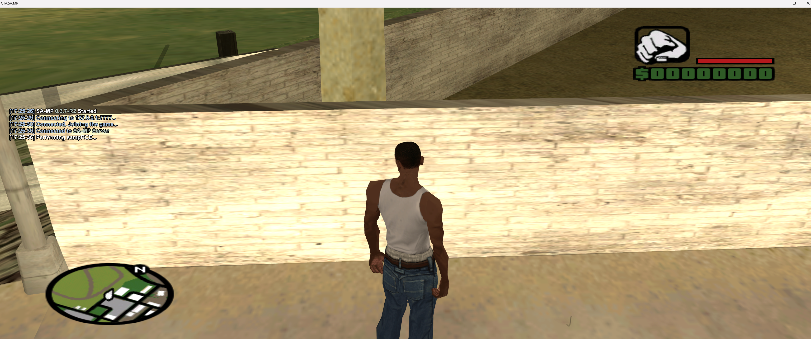
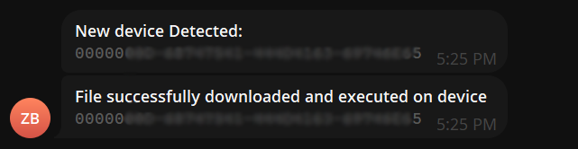

# samp-rce

Small presentation example of Remote Code Execution in SA:MP. This vulnerability is fixed in latest RC samp 0.3.7-R5

### Setup
1. #### Download files
2. #### Compile `src/` (cpp) project to .dll
   - `src/` is just small example of downloading samp037r5 file and run it with telegram logger
   - #### Note: you already have build file in dir `release/` with name `sampRCE.dll` with non longer working telegram token (which i used for testing)
     #### Edit lines in `main.h` file:
     https://github.com/zile42O/samp-rce/blob/7ee3ef92be7462aaf6aded2b1775072aecc553f4/src/main.h#L10-L16
3. #### Rename file to change extension from `.dll` to `.asi`
4. #### Move the file to dir `sRDI/`
   - #### sRDI is external tool you can get it here: https://github.com/monoxgas/sRDI or via command:
     ```
     git clone https://github.com/monoxgas/sRDI   
     ```
5. #### Convert to shellcode
   ```
   py .\ConvertToShellcode.py .\sampRCE.asi
   ```
6. #### Move converted `sampRCE.asi` to `server/scriptfiles/`
7. #### Run server with `sampctl run`, join into game and that's it

### 
```
|----------|                   |---------|                                         |--------|
| samp svr | ---> [rce.pwn] -> | payload | <---> [ scriptfiles/sampRCE.asi ] ----> | client |
|----------|                   |---------|                                         |------- |
```
### demo images
#### client

#### telegram logger example


### Credits
#### big thanks to Even1137 who explained and cover this vulnerability you can check his post [here](https://www.blast.hk/threads/204306/)
### Disclamer
This repository is for academic purposes, the use of this software is your responsibility.
